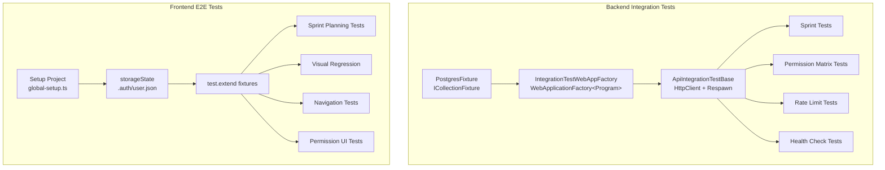
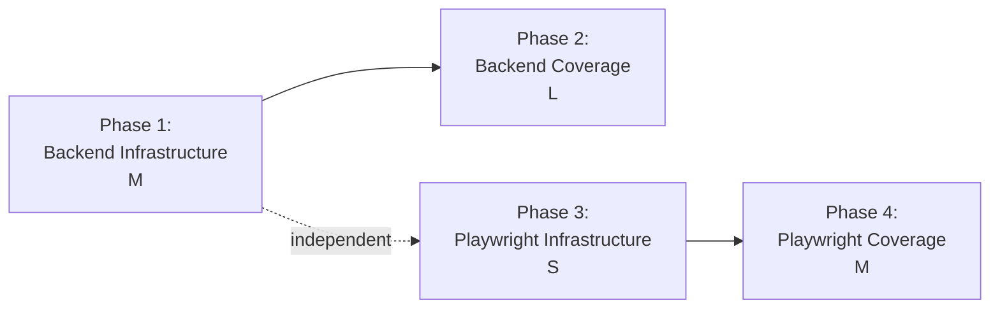

# Integration & E2E Testing Strategy -- Implementation Plan

**Date:** 2026-03-15
**ADR:** `docs/adrs/260315-integration-e2e-testing-strategy.md`
**Scope:** Fullstack (backend + frontend)
**Status:** DRAFT -- awaiting approval

---

## Architecture Overview



## Dependency Diagram



Phases 1 and 3 are independent and can run in parallel. Phase 2 depends on Phase 1. Phase 4 depends on Phase 3.

---

## Phase 1: Backend Integration Infrastructure (M)

**Goal:** Replace per-class container startup with shared Testcontainer + WebApplicationFactory + Respawn.

### Task 1.1: Add Respawn NuGet package (S)
**File:** `tests/TeamFlow.Api.Tests/TeamFlow.Api.Tests.csproj`
- Add `<PackageReference Include="Respawn" Version="4.0.0" />`
- Dependency: none

### Task 1.2: Create PostgresFixture (S)
**File (create):** `tests/TeamFlow.Api.Tests/Infrastructure/PostgresFixture.cs`
- Implements `IAsyncLifetime`
- Starts a single `PostgreSqlContainer` on `InitializeAsync`
- Exposes `ConnectionString` property
- Stops container on `DisposeAsync`
- Define `[CollectionDefinition("Integration")]` attribute class in same file
- All integration test classes will use `[Collection("Integration")]` to share this container

**TFD approach:**
1. Write a test that resolves `PostgresFixture` from collection and asserts `ConnectionString` is not empty
2. Implement the fixture
3. Verify the container starts once for the collection

### Task 1.3: Create IntegrationTestWebAppFactory (M)
**File (create):** `tests/TeamFlow.Api.Tests/Infrastructure/IntegrationTestWebAppFactory.cs`
- Extends `WebApplicationFactory<Program>`
- Accepts `PostgresFixture` via constructor
- Overrides `ConfigureWebHost`:
  - Replace `TeamFlowDbContext` connection string with Testcontainer's
  - Replace `IBroadcastService` with `NullBroadcastService`
  - Remove RabbitMQ health check (replace with `NullHealthCheck`)
  - Disable auto-migration in Program.cs (factory handles it)
  - Run `EnsureCreatedAsync` on startup
  - Seed reference data (org, user) matching `IntegrationTestBase.SeedOrgId` / `SeedUserId`

**TFD approach:**
1. Write a test that creates the factory, gets an `HttpClient`, and GETs `/health` expecting 200
2. Implement the factory
3. Refine until health check passes

### Task 1.4: Create ApiIntegrationTestBase (M)
**File (create):** `tests/TeamFlow.Api.Tests/Infrastructure/ApiIntegrationTestBase.cs`
- Implements `IAsyncLifetime`
- Decorated with `[Collection("Integration")]`
- Injects `IntegrationTestWebAppFactory` and `PostgresFixture`
- Holds a `Respawner` instance, initialized in `InitializeAsync` with the Testcontainer connection string
- `InitializeAsync`: reset DB via `Respawner.ResetAsync`, re-seed reference data
- Provides helper methods:
  - `CreateAuthenticatedClient(ProjectRole role)` -- generates a real JWT for a seeded user with a given role, returns `HttpClient` with `Authorization: Bearer` header
  - `CreateAnonymousClient()` -- returns `HttpClient` without auth header
  - `SeedProjectAsync()` -- seeds org + project + membership for the current test user
- `DisposeAsync`: no-op (container lifecycle managed by fixture)

**TFD approach:**
1. Write a test that calls `CreateAuthenticatedClient(ProjectRole.Developer)` and GETs a protected endpoint, expecting 200
2. Write a test that calls `CreateAnonymousClient()` and GETs the same endpoint, expecting 401
3. Implement the base class

### Task 1.5: Proof of concept -- migrate one test (S)
**File (modify):** `tests/TeamFlow.Api.Tests/Projects/ProjectLifecycleTests.cs`
- Rewrite to extend `ApiIntegrationTestBase` instead of `IntegrationTestBase`
- Use `HttpClient` to POST/GET/PUT/DELETE projects at HTTP level
- Assert on status codes, response body shapes, ProblemDetails for errors
- Keep old test file as `ProjectLifecycleTests_Legacy.cs` temporarily for comparison

**TFD approach:**
1. Write the HTTP-level test that POSTs to `/api/v1/projects` and asserts 201
2. Run it against the new infrastructure (should fail until factory is wired)
3. Fix factory until test passes

### Phase 1 File Ownership
| File | Owner |
|------|-------|
| `tests/TeamFlow.Api.Tests/TeamFlow.Api.Tests.csproj` | Phase 1 |
| `tests/TeamFlow.Api.Tests/Infrastructure/PostgresFixture.cs` | Phase 1 |
| `tests/TeamFlow.Api.Tests/Infrastructure/IntegrationTestWebAppFactory.cs` | Phase 1 |
| `tests/TeamFlow.Api.Tests/Infrastructure/ApiIntegrationTestBase.cs` | Phase 1 |
| `tests/TeamFlow.Api.Tests/Projects/ProjectLifecycleTests.cs` | Phase 1 (migration) |

---

## Phase 2: Backend Test Coverage (L)

**Goal:** HTTP-level tests for all Sprint endpoints, permission matrix, rate limiting, health checks, ProblemDetails shape.

**Depends on:** Phase 1 complete.

### Task 2.1: Sprint CRUD endpoint tests (M)
**File (create):** `tests/TeamFlow.Api.Tests/Sprints/SprintCrudTests.cs`
- Extends `ApiIntegrationTestBase`
- Tests for each endpoint:
  - `POST /sprints` -- 201 with valid body, 400 with missing fields, 403 for Viewer role
  - `GET /sprints?projectId=X` -- 200 with pagination shape, empty list for non-existent project
  - `GET /sprints/{id}` -- 200 with detail shape, 404 for non-existent
  - `PUT /sprints/{id}` -- 200 with updated fields, 400 for invalid body
  - `DELETE /sprints/{id}` -- 204 on success, 400 for active sprint

**TFD approach:** Write all test method signatures with `[Fact]`/`[Theory]` first, run to see them all fail, then implement one at a time.

### Task 2.2: Sprint lifecycle endpoint tests (M)
**File (create):** `tests/TeamFlow.Api.Tests/Sprints/SprintLifecycleTests.cs`
- `POST /sprints/{id}/start` -- 200 when Planning, 409 when already Active, 400 when no items
- `POST /sprints/{id}/complete` -- 200 when Active, 400 when not Active
- `POST /sprints/{id}/items/{workItemId}` -- 200 on success, 409 for duplicate, 400 for wrong project
- `DELETE /sprints/{id}/items/{workItemId}` -- 204 on success
- `PUT /sprints/{id}/capacity` -- 200 with valid entries, 400 with invalid
- `GET /sprints/{id}/burndown` -- 200 with data shape, 404 for non-existent

### Task 2.3: Permission matrix tests (L)
**File (create):** `tests/TeamFlow.Api.Tests/Sprints/SprintPermissionMatrixTests.cs`
- Uses `[Theory]` with `[MemberData]` to generate role x endpoint combinations
- Tests all 6 roles against all 11 Sprint endpoints
- Expected outcomes table:

| Endpoint | OrgAdmin | ProductOwner | TechLead | TeamManager | Developer | Viewer |
|----------|----------|--------------|----------|-------------|-----------|--------|
| POST /sprints | 201 | 201 | 201 | 201 | 403 | 403 |
| GET /sprints | 200 | 200 | 200 | 200 | 200 | 200 |
| GET /sprints/{id} | 200 | 200 | 200 | 200 | 200 | 200 |
| PUT /sprints/{id} | 200 | 200 | 200 | 200 | 403 | 403 |
| DELETE /sprints/{id} | 204 | 204 | 204 | 204 | 403 | 403 |
| POST .../start | 200 | 200 | 200 | 200 | 403 | 403 |
| POST .../complete | 200 | 200 | 200 | 200 | 403 | 403 |
| POST .../items/{wid} | 200 | 200 | 200 | 200 | 403 | 403 |
| DELETE .../items/{wid} | 204 | 204 | 204 | 204 | 403 | 403 |
| PUT .../capacity | 200 | 200 | 200 | 200 | 403 | 403 |
| GET .../burndown | 200 | 200 | 200 | 200 | 200 | 200 |

Note: Exact permission mappings depend on `PermissionChecker` role-to-permission resolution. The table above is the expected contract -- tests will verify it. If reality differs, fix the permission mapping or update the table.

### Task 2.4: Rate limiting tests (S)
**File (create):** `tests/TeamFlow.Api.Tests/RateLimiting/RateLimitIntegrationTests.cs`
- Uses `ApiIntegrationTestBase` with custom rate limit config (low limits for test speed)
- Override `RateLimitSettings` in `IntegrationTestWebAppFactory` to set `WritePermitLimit = 3`
- Blast 4+ write requests, verify 4th returns 429
- Verify `Retry-After` header is present on 429 response
- Verify response body is `ProblemDetails` with status 429

### Task 2.5: Health check tests (S)
**File (create):** `tests/TeamFlow.Api.Tests/Health/HealthCheckTests.cs`
- `GET /health` -- 200 with JSON body containing `status`, `checks` array
- Verify DB check reports Healthy when Testcontainer is up
- Verify RabbitMQ check reports Degraded (since we replace with null check)

### Task 2.6: ProblemDetails shape tests (S)
**File (create):** `tests/TeamFlow.Api.Tests/ErrorHandling/ProblemDetailsShapeTests.cs`
- Send requests that produce 400, 403, 404, 409 errors
- Deserialize response as `ProblemDetails`
- Assert: `status`, `title`, `detail`, `instance` (matches request path), `extensions.correlationId` are all present
- Verify `Content-Type: application/problem+json`

### Phase 2 File Ownership
| File | Owner |
|------|-------|
| `tests/TeamFlow.Api.Tests/Sprints/SprintCrudTests.cs` | Phase 2 |
| `tests/TeamFlow.Api.Tests/Sprints/SprintLifecycleTests.cs` | Phase 2 |
| `tests/TeamFlow.Api.Tests/Sprints/SprintPermissionMatrixTests.cs` | Phase 2 |
| `tests/TeamFlow.Api.Tests/RateLimiting/RateLimitIntegrationTests.cs` | Phase 2 |
| `tests/TeamFlow.Api.Tests/Health/HealthCheckTests.cs` | Phase 2 |
| `tests/TeamFlow.Api.Tests/ErrorHandling/ProblemDetailsShapeTests.cs` | Phase 2 |

---

## Phase 3: Playwright Infrastructure (S)

**Goal:** Add global auth setup project, `data-testid` attributes, standardize fixtures, cleanup hooks.

**Independent of Phase 1/2.** Can run in parallel.

### Task 3.1: Add setup project for global auth (S)
**Files (modify):**
- `src/apps/teamflow-web/playwright.config.ts`
- **File (create):** `src/apps/teamflow-web/e2e/global-setup.ts`
- **File (create):** `src/apps/teamflow-web/.auth/` directory (gitignored)

Changes to `playwright.config.ts`:
```typescript
projects: [
  {
    name: "setup",
    testMatch: /global-setup\.ts/,
  },
  {
    name: "chromium",
    use: { ...devices["Desktop Chrome"], storageState: ".auth/user.json" },
    dependencies: ["setup"],
  },
],
```

`global-setup.ts`:
- Register a test user via API
- Login via API
- Set `storageState` to `.auth/user.json` containing cookies + localStorage auth tokens
- Add `.auth/` to `.gitignore`

### Task 3.2: Add `data-testid` to critical components (M)
Components that need `data-testid` attributes (interactive elements only):

| Component | Testids to add |
|-----------|---------------|
| `components/sprints/sprint-card.tsx` | `sprint-card-{id}`, `sprint-status-{status}` |
| `components/sprints/sprint-form-dialog.tsx` | `sprint-form-dialog`, `sprint-name-input`, `sprint-goal-input`, `sprint-start-date`, `sprint-end-date`, `sprint-submit-btn` |
| `components/sprints/sprint-planning-board.tsx` | `sprint-planning-board`, `backlog-panel`, `sprint-panel` |
| `components/sprints/capacity-form.tsx` | `capacity-form`, `capacity-member-{id}`, `capacity-save-btn` |
| `components/sprints/burndown-chart.tsx` | `burndown-chart` |
| `components/sprints/add-item-confirmation.tsx` | `add-item-confirm-dialog`, `add-item-confirm-btn`, `add-item-cancel-btn` |
| `components/layout/top-bar.tsx` | `top-bar`, `nav-projects`, `nav-teams`, `user-menu-btn` |
| `components/layout/user-menu.tsx` | `user-menu`, `logout-btn` |
| `components/layout/theme-toggle.tsx` | `theme-toggle` |
| `components/shared/pagination.tsx` | `pagination`, `page-next`, `page-prev` |

### Task 3.3: Standardize test.extend fixtures (S)
**File (modify):** `src/apps/teamflow-web/e2e/fixtures/auth.ts`
- Add `storageState` awareness -- if storageState exists, skip re-registration
- Export a unified `test` fixture that includes both auth and sprint helpers

**File (modify):** `src/apps/teamflow-web/e2e/fixtures/sprint-helpers.ts`
- Refactor from raw exported functions to a `test.extend` fixture
- Replace `authenticatePage` localStorage injection with `storageState` usage
- Export as part of unified fixtures

**File (create):** `src/apps/teamflow-web/e2e/fixtures/index.ts`
- Re-export merged `test` and `expect` from combined fixtures
- All spec files import from `../fixtures` instead of `../fixtures/auth` or `../fixtures/sprint-helpers`

### Task 3.4: Add afterAll cleanup hooks (S)
**File (modify):** All spec files that create test data via API
- Add `test.afterAll` that deletes created projects/users via API
- Keep cleanup best-effort (don't fail test if cleanup fails)

### Phase 3 File Ownership
| File | Owner |
|------|-------|
| `src/apps/teamflow-web/playwright.config.ts` | Phase 3 |
| `src/apps/teamflow-web/e2e/global-setup.ts` | Phase 3 |
| `src/apps/teamflow-web/e2e/fixtures/auth.ts` | Phase 3 |
| `src/apps/teamflow-web/e2e/fixtures/sprint-helpers.ts` | Phase 3 |
| `src/apps/teamflow-web/e2e/fixtures/index.ts` | Phase 3 |
| `src/apps/teamflow-web/components/sprints/*.tsx` | Phase 3 (data-testid only) |
| `src/apps/teamflow-web/components/layout/*.tsx` | Phase 3 (data-testid only) |
| `src/apps/teamflow-web/components/shared/pagination.tsx` | Phase 3 (data-testid only) |

---

## Phase 4: Playwright E2E Coverage (M)

**Goal:** Sprint planning flow E2E tests, visual regression baselines, navigation tests, permission-based UI tests.

**Depends on:** Phase 3 complete.

### Task 4.1: Sprint planning flow E2E tests (M)
**File (modify):** `src/apps/teamflow-web/e2e/sprints/sprint-planning.spec.ts`
- Refactor existing tests to use new unified fixtures and `data-testid` selectors
- Add tests:
  - Create sprint, add items from backlog panel, verify capacity indicator
  - Update sprint dates, verify calendar reflects changes
  - Remove item from sprint, verify backlog panel updates

### Task 4.2: Visual regression baselines (M)
**File (create):** `src/apps/teamflow-web/e2e/visual/sprint-screenshots.spec.ts`
- Capture baseline screenshots for:
  - Sprint list page (empty state + with sprints)
  - Sprint detail page (Planning, Active, Completed states)
  - Burndown chart
  - Sprint planning board with backlog panel
- Each screenshot captured in both light and dark mode (use `theme-toggle` data-testid)
- Store baselines in `e2e/visual/snapshots/`

### Task 4.3: Cross-page navigation tests (S)
**File (create):** `src/apps/teamflow-web/e2e/navigation/sprint-navigation.spec.ts`
- Navigate: Projects list -> Project detail -> Sprints tab -> Sprint detail -> Burndown
- Verify breadcrumb updates at each step
- Verify back navigation works
- Verify deep-link to sprint detail loads correctly

### Task 4.4: Permission-based UI tests (M)
**File (create):** `src/apps/teamflow-web/e2e/permissions/sprint-permissions.spec.ts`
- Viewer role: verify "New Sprint" button is hidden, start/complete buttons are hidden
- Developer role: verify same restrictions as Viewer for sprint management
- TeamManager role: verify all sprint management buttons visible
- Use `data-testid` selectors added in Phase 3

### Phase 4 File Ownership
| File | Owner |
|------|-------|
| `src/apps/teamflow-web/e2e/sprints/sprint-planning.spec.ts` | Phase 4 |
| `src/apps/teamflow-web/e2e/visual/sprint-screenshots.spec.ts` | Phase 4 |
| `src/apps/teamflow-web/e2e/visual/snapshots/` | Phase 4 |
| `src/apps/teamflow-web/e2e/navigation/sprint-navigation.spec.ts` | Phase 4 |
| `src/apps/teamflow-web/e2e/permissions/sprint-permissions.spec.ts` | Phase 4 |

---

## Effort Summary

| Phase | Effort | Tasks | Depends on |
|-------|--------|-------|------------|
| Phase 1: Backend Infrastructure | M | 5 tasks | -- |
| Phase 2: Backend Coverage | L | 6 tasks | Phase 1 |
| Phase 3: Playwright Infrastructure | S | 4 tasks | -- |
| Phase 4: Playwright Coverage | M | 4 tasks | Phase 3 |

**Parallel execution:** Phases 1+3 can run simultaneously. Phases 2+4 can run simultaneously once their dependencies complete.

## Key Decisions

1. **Respawn over EF recreate** -- Respawn truncates tables in FK order without dropping/recreating the schema. Faster than `EnsureDeleted` + `EnsureCreated` per test.
2. **ICollectionFixture over per-class** -- One Postgres container for the entire test collection. Current approach starts a new container per test class, which does not scale.
3. **Real JWT generation in tests** -- `ApiIntegrationTestBase.CreateAuthenticatedClient` generates actual JWTs using the same secret configured in the test factory. This tests the full auth middleware pipeline.
4. **storageState over localStorage injection** -- Playwright's built-in `storageState` is more reliable than manual `localStorage.setItem` and persists across browser contexts.
5. **data-testid scoped to interactive elements** -- Only buttons, forms, navigation, and data displays. Not on every `<div>`.

## Assumptions
- Permission-to-role mapping in `PermissionChecker` matches the matrix in Task 2.3. If not, tests will reveal the mismatch and the matrix should be corrected.
- Sprint components already render conditional UI based on role (e.g., hiding buttons for Viewer). If not, Phase 4 permission UI tests will drive that implementation.
