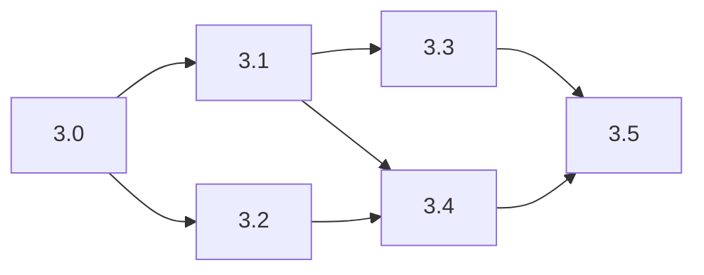
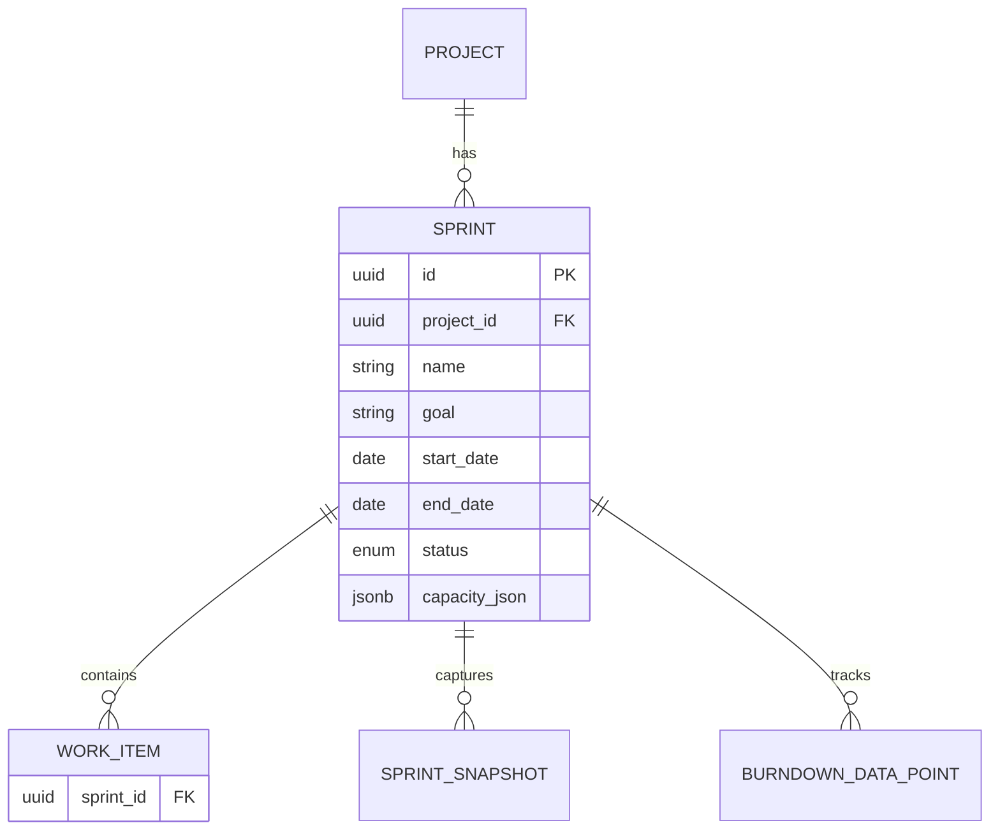

# Phase 3: Hardening + Sprint Planning + MVP Release

**Created:** 2026-03-15
**Scope:** Fullstack (Backend + Frontend + Background Jobs)
**Duration:** 4 weeks (Weeks 9-12)
**Discovery:** [discovery-context.md](discovery-context.md)
**Spec:** `docs/process/phases.md` -- Phase 3

---

## Executive Summary

Phase 3 turns TeamFlow into a production-worthy MVP. Two tracks run in parallel after a shared contract phase:

1. **Sprint Planning** -- new CQRS feature slice enabling sprint creation, backlog-to-sprint item movement, per-member capacity tracking, scope locking on start, and realtime broadcasts.
2. **Hardening** -- four scheduled background jobs, test coverage gap closure (target >=70% Application layer), performance optimization for 1000-item backlogs, structured observability, and production readiness.

No new features beyond sprint planning. The final week is reserved for dogfooding and P0/P1 bug resolution.

---

## Phase Overview

| Sub-Phase | Goal | Size | Dependencies | Parallel | Status |
|-----------|------|------|--------------|----------|--------|
| 3.0 | API Contract + Domain Model | M | Phase 2 complete | No | completed |
| 3.1 | Sprint Planning Backend | L | 3.0 | Yes (with 3.2) | completed |
| 3.2 | Sprint Planning Frontend | M | 3.0 | Yes (with 3.1) | pending |
| 3.3 | Background Jobs | L | 3.1 | No | pending |
| 3.4 | Hardening (Tests + Perf + Observability) | XL | 3.1, 3.2 | No | completed |
| 3.5 | Integration + Dogfooding | L | 3.3, 3.4 | No | pending |



---

## Phase 3.0 -- API Contract + Domain Model Changes

**Goal:** Define all new endpoints, finalize domain model additions, create the contract that 3.1 and 3.2 build against.

**Deliverable:** `docs/plans/phase-3-sprint-hardening/api-contract-260315-1200.md`

### New Domain Entities

No new tables required. The `sprints`, `sprint_snapshots`, `burndown_data_points`, and `team_velocity_history` tables already exist from Phase 0 schema. The `Sprint` entity, `SprintStatus` enum, and `SprintDomainEvents` are already defined.

**Entities to verify/update (no structural migration):**

| Entity | File | Change |
|--------|------|--------|
| `Sprint` | `Domain/Entities/Sprint.cs` | Mark `sealed`. Add domain methods: `Start()`, `Complete()`, `CanAddItem()`. |
| `SprintSnapshot` | `Domain/Entities/SprintSnapshot.cs` | Mark `sealed`. |
| `BurndownDataPoint` | `Domain/Entities/BurndownDataPoint.cs` | Mark `sealed`. |

**New interfaces needed:**

| Interface | File |
|-----------|------|
| `ISprintRepository` | `Application/Common/Interfaces/ISprintRepository.cs` |
| `IBurndownDataPointRepository` | `Application/Common/Interfaces/IBurndownDataPointRepository.cs` |
| `ISprintSnapshotRepository` | `Application/Common/Interfaces/ISprintSnapshotRepository.cs` |

**New test builder needed:**

| Builder | File |
|---------|------|
| `BurndownDataPointBuilder` | `tests/TeamFlow.Tests.Common/Builders/BurndownDataPointBuilder.cs` |

### Entity Relationship Diagram



### API Contract -- Sprint Endpoints

New controller: `SprintsController` at `/api/v1/sprints`

| Method | Route | Permission | Rate Limit | Request | Response |
|--------|-------|------------|------------|---------|----------|
| POST | `/` | Sprint_Create | Write | `CreateSprintCommand` | 201 `SprintDto` |
| GET | `/` | Project_View | General | query: `projectId` | 200 Paginated `SprintDto[]` |
| GET | `/{id}` | Project_View | General | -- | 200 `SprintDetailDto` |
| PUT | `/{id}` | Sprint_Edit | Write | `UpdateSprintBody` | 200 `SprintDto` |
| DELETE | `/{id}` | Sprint_Edit | Write | -- | 204 |
| POST | `/{id}/start` | Sprint_Start | Write | -- | 200 `SprintDto` |
| POST | `/{id}/complete` | Sprint_Close | Write | -- | 200 `SprintDto` |
| POST | `/{id}/items/{workItemId}` | Sprint_Edit | Write | -- | 200 |
| DELETE | `/{id}/items/{workItemId}` | Sprint_Edit | Write | -- | 204 |
| PUT | `/{id}/capacity` | Sprint_Edit | Write | `UpdateCapacityBody` | 200 |
| GET | `/{id}/burndown` | Project_View | General | -- | 200 `BurndownDto` |

#### Request/Response Shapes

```
CreateSprintCommand {
  projectId: uuid,
  name: string (max 100),
  goal: string?,
  startDate: date?,
  endDate: date?
}

UpdateSprintBody {
  name: string (max 100),
  goal: string?,
  startDate: date?,
  endDate: date?
}

UpdateCapacityBody {
  capacity: { memberId: uuid, points: int }[]
}

SprintDto {
  id: uuid,
  projectId: uuid,
  name: string,
  goal: string?,
  startDate: date?,
  endDate: date?,
  status: "Planning" | "Active" | "Completed",
  totalPoints: int,
  completedPoints: int,
  itemCount: int,
  capacityUtilization: float?,
  createdAt: ISO8601
}

SprintDetailDto extends SprintDto {
  items: WorkItemDto[],
  capacity: { memberId: uuid, memberName: string, capacityPoints: int, assignedPoints: int }[]
}

BurndownDto {
  sprintId: uuid,
  idealLine: { date: date, points: int }[],
  actualLine: { date: date, remainingPoints: int, completedPoints: int, addedPoints: int }[]
}
```

#### Permission Mapping

| Permission | Roles |
|------------|-------|
| Sprint_Create | OrgAdmin, TeamManager |
| Sprint_Start | OrgAdmin, TeamManager |
| Sprint_Close | OrgAdmin, TeamManager |
| Sprint_Edit | OrgAdmin, PO, TechLead, TeamManager |
| Sprint_AddItem (active sprint) | OrgAdmin, TeamManager (confirmation required) |

### Domain Events (Phase 3)

These event contracts already exist in `SprintDomainEvents.cs`:

| Event | Trigger |
|-------|---------|
| `SprintStartedDomainEvent` | Sprint transitions Planning -> Active |
| `SprintCompletedDomainEvent` | Sprint transitions Active -> Completed |
| `SprintItemAddedDomainEvent` | Work item moved to sprint |
| `SprintItemRemovedDomainEvent` | Work item removed from sprint |

New event needed:

| Event | Trigger |
|-------|---------|
| `ReleaseOverdueDetectedDomainEvent` | ReleaseOverdueDetectorJob detects overdue release |
| `WorkItemStaleFlaggedDomainEvent` | StaleItemDetectorJob flags stale item |

Add to `Domain/Events/ReleaseDomainEvents.cs` and `Domain/Events/WorkItemDomainEvents.cs` respectively.

### Success Criteria (Phase 3.0)
- [x] API contract document complete with all endpoints, shapes, and error codes
- [x] All domain entity changes identified (no new migrations required)
- [x] New interfaces defined
- [x] Permission mapping aligned with `roles-permissions.md`

---

## Phase 3.1 -- Sprint Planning Backend

<!-- PARALLEL: yes (with Phase 3.2) -->
<!-- FILE OWNERSHIP: src/core/TeamFlow.Application/Features/Sprints/**, src/core/TeamFlow.Application/Common/Interfaces/ISprint*.cs, src/core/TeamFlow.Application/Common/Interfaces/IBurndown*.cs, src/core/TeamFlow.Infrastructure/Repositories/Sprint*.cs, src/core/TeamFlow.Infrastructure/Repositories/Burndown*.cs, src/apps/TeamFlow.Api/Controllers/SprintsController.cs, tests/TeamFlow.Application.Tests/Features/Sprints/**, tests/TeamFlow.Api.Tests/Sprints/** -->

**Goal:** Full Sprint CRUD, item management, capacity tracking, scope locking, and realtime events.

### 3.1.1 -- Sprint repository and interfaces (S)

**Layer:** Application + Infrastructure

| Task | Files |
|------|-------|
| Create `ISprintRepository` | `Application/Common/Interfaces/ISprintRepository.cs` (new) |
| Create `IBurndownDataPointRepository` | `Application/Common/Interfaces/IBurndownDataPointRepository.cs` (new) |
| Create `ISprintSnapshotRepository` | `Application/Common/Interfaces/ISprintSnapshotRepository.cs` (new) |
| Implement `SprintRepository` | `Infrastructure/Repositories/SprintRepository.cs` (new) |
| Implement `BurndownDataPointRepository` | `Infrastructure/Repositories/BurndownDataPointRepository.cs` (new) |
| Implement `SprintSnapshotRepository` | `Infrastructure/Repositories/SprintSnapshotRepository.cs` (new) |
| Add `BurndownDataPointBuilder` | `tests/TeamFlow.Tests.Common/Builders/BurndownDataPointBuilder.cs` (new) |
| Register repositories in DI | `Infrastructure/DependencyInjection.cs` |

Key repository methods:

```
ISprintRepository:
  - GetByIdAsync(id, ct)
  - GetByIdWithItemsAsync(id, ct)
  - GetActiveSprintForProjectAsync(projectId, ct)
  - ListByProjectPagedAsync(projectId, page, pageSize, ct)
  - AddAsync(sprint, ct)
  - UpdateAsync(sprint, ct)
  - DeleteAsync(sprint, ct)

IBurndownDataPointRepository:
  - GetBySprintAsync(sprintId, ct)
  - AddAsync(point, ct)
  - ExistsForDateAsync(sprintId, date, ct)

ISprintSnapshotRepository:
  - AddAsync(snapshot, ct)
  - GetFinalAsync(sprintId, ct)
```

### 3.1.2 -- Create Sprint handler (M)

**Layer:** Application
**TFD: Write tests first.**

| Task | Files |
|------|-------|
| `CreateSprintCommand` + `CreateSprintValidator` | `Application/Features/Sprints/CreateSprint/` (new) |
| `CreateSprintHandler` | Same directory |
| `SprintDto` | `Application/Features/Sprints/SprintDto.cs` (new) |

Business rules:
- Name required, max 100 chars
- ProjectId must reference existing project
- If dates provided: endDate > startDate
- Only one Active sprint per project at a time (validation on start, not create)
- Permission: `Sprint_Create` (OrgAdmin, TeamManager)

**Tests (TFD):**

| Test | File |
|------|------|
| Valid command creates sprint in Planning status | `tests/TeamFlow.Application.Tests/Features/Sprints/CreateSprintTests.cs` (new) |
| Theory: empty name, invalid project return validation error | Same file |
| End date before start date returns validation error | Same file |
| User without Sprint_Create permission returns ForbiddenError | Same file |

### 3.1.3 -- Update and Delete Sprint handlers (S)

**Layer:** Application
**TFD: Write tests first.**

| Task | Files |
|------|-------|
| `UpdateSprintCommand` + handler + validator | `Application/Features/Sprints/UpdateSprint/` (new) |
| `DeleteSprintCommand` + handler | `Application/Features/Sprints/DeleteSprint/` (new) |

Business rules:
- Cannot update/delete Active or Completed sprint
- Delete unlinks all work items (sets sprint_id = null)

**Tests (TFD):**

| Test | File |
|------|------|
| Update Planning sprint succeeds | `tests/TeamFlow.Application.Tests/Features/Sprints/UpdateSprintTests.cs` (new) |
| Update Active sprint returns error | Same file |
| Delete Planning sprint succeeds, unlinks items | `tests/TeamFlow.Application.Tests/Features/Sprints/DeleteSprintTests.cs` (new) |
| Delete Active sprint returns error | Same file |

### 3.1.4 -- List and Get Sprint handlers (S)

**Layer:** Application

| Task | Files |
|------|-------|
| `ListSprintsQuery` + handler | `Application/Features/Sprints/ListSprints/` (new) |
| `GetSprintQuery` + handler | `Application/Features/Sprints/GetSprint/` (new) |
| `SprintDetailDto` | `Application/Features/Sprints/SprintDetailDto.cs` (new) |

**Tests (TFD):**

| Test | File |
|------|------|
| List returns sprints for project, paginated | `tests/TeamFlow.Application.Tests/Features/Sprints/ListSprintsTests.cs` (new) |
| Get returns sprint with items and capacity breakdown | `tests/TeamFlow.Application.Tests/Features/Sprints/GetSprintTests.cs` (new) |
| Get non-existent sprint returns NotFoundError | Same file |

### 3.1.5 -- Sprint item management (M)

**Layer:** Application
**TFD: Write tests first.**

| Task | Files |
|------|-------|
| `AddItemToSprintCommand` + handler | `Application/Features/Sprints/AddItem/` (new) |
| `RemoveItemFromSprintCommand` + handler | `Application/Features/Sprints/RemoveItem/` (new) |

Business rules:
- Adding item to Planning sprint: allowed for Sprint_Edit roles
- Adding item to Active sprint: requires TeamManager or OrgAdmin confirmation
- Item can only belong to one sprint at a time
- Moving item updates `work_items.sprint_id`
- Publishes `SprintItemAddedDomainEvent` / `SprintItemRemovedDomainEvent`
- Records history via `IHistoryService`

**Tests (TFD):**

| Test | File |
|------|------|
| Add item to Planning sprint succeeds | `tests/TeamFlow.Application.Tests/Features/Sprints/AddItemTests.cs` (new) |
| Add item to Active sprint without TeamManager role returns ForbiddenError | Same file |
| Add item already in another sprint returns ConflictError | Same file |
| Remove item from sprint sets sprint_id null, publishes event | `tests/TeamFlow.Application.Tests/Features/Sprints/RemoveItemTests.cs` (new) |
| Add item publishes SprintItemAddedDomainEvent | `AddItemTests.cs` |

### 3.1.6 -- Start and Complete Sprint (M)

**Layer:** Application
**TFD: Write tests first.**
**Constraint:** HUMAN-REVIEWED (scope locking logic)

| Task | Files |
|------|-------|
| `StartSprintCommand` + handler | `Application/Features/Sprints/StartSprint/` (new) |
| `CompleteSprintCommand` + handler | `Application/Features/Sprints/CompleteSprint/` (new) |

Business rules -- Start:
- Only Planning sprint can start
- Must have at least one item
- Must have start and end dates set
- Only one Active sprint per project (check before starting)
- Sets status to Active, publishes `SprintStartedDomainEvent`
- Permission: `Sprint_Start` (OrgAdmin, TeamManager)

Business rules -- Complete:
- Only Active sprint can complete
- Sets status to Completed
- Carried items: set sprint_id = null
- Publishes `SprintCompletedDomainEvent` with planned/completed points
- Permission: `Sprint_Close` (OrgAdmin, TeamManager)

**Tests (TFD):**

| Test | File |
|------|------|
| Start Planning sprint with items succeeds, status = Active | `tests/TeamFlow.Application.Tests/Features/Sprints/StartSprintTests.cs` (new) |
| Start sprint with no items returns error | Same file |
| Start sprint when another is Active returns ConflictError | Same file |
| Start sprint publishes SprintStartedDomainEvent | Same file |
| Complete Active sprint succeeds, carries over incomplete items | `tests/TeamFlow.Application.Tests/Features/Sprints/CompleteSprintTests.cs` (new) |
| Complete Planning sprint returns error | Same file |
| Complete sprint publishes SprintCompletedDomainEvent | Same file |
| Non-TeamManager cannot start sprint returns ForbiddenError | `StartSprintTests.cs` |

### 3.1.7 -- Capacity management (S)

**Layer:** Application
**TFD: Write tests first.**

| Task | Files |
|------|-------|
| `UpdateCapacityCommand` + handler + validator | `Application/Features/Sprints/UpdateCapacity/` (new) |

Business rules:
- Updates `capacity_json` on Sprint entity
- Each member capacity must be > 0
- Only editable in Planning status

**Tests (TFD):**

| Test | File |
|------|------|
| Update capacity for Planning sprint succeeds | `tests/TeamFlow.Application.Tests/Features/Sprints/UpdateCapacityTests.cs` (new) |
| Update capacity for Active sprint returns error | Same file |
| Theory: zero/negative capacity returns validation error | Same file |

### 3.1.8 -- Burndown query (S)

**Layer:** Application

| Task | Files |
|------|-------|
| `GetBurndownQuery` + handler | `Application/Features/Sprints/GetBurndown/` (new) |
| `BurndownDto` | `Application/Features/Sprints/BurndownDto.cs` (new) |

Computes ideal burndown line from total points and working days. Returns actual data from `burndown_data_points`.

**Tests (TFD):**

| Test | File |
|------|------|
| Returns burndown data for sprint with data points | `tests/TeamFlow.Application.Tests/Features/Sprints/GetBurndownTests.cs` (new) |
| Empty sprint returns empty arrays | Same file |

### 3.1.9 -- Sprints controller (S)

**Layer:** Api

| Task | Files |
|------|-------|
| Create `SprintsController` with all endpoints from contract | `Api/Controllers/SprintsController.cs` (new) |
| Add `[Authorize]`, `[EnableRateLimiting]`, `[ProducesResponseType]` | Same file |

**Tests (TFD):**

| Test | File |
|------|------|
| Full sprint lifecycle through API: create -> add items -> start -> complete | `tests/TeamFlow.Api.Tests/Sprints/SprintLifecycleTests.cs` (new) |
| POST /sprints with invalid body returns 400 | Same file |
| GET /sprints/{id}/burndown returns 200 | Same file |

### Phase 3.1 Success Criteria
- [x] All 11 Sprint endpoints implemented and passing tests
- [x] Permission checks on all mutating handlers
- [x] Domain events published for start, complete, add/remove item
- [x] History recorded for all item movements
- [x] Scope locking enforced on Active sprints

---

## Phase 3.2 -- Sprint Planning Frontend

<!-- PARALLEL: yes (with Phase 3.1) -->
<!-- FILE OWNERSHIP: src/apps/teamflow-web/app/projects/[projectId]/sprints/**, src/apps/teamflow-web/lib/api/sprints.ts, src/apps/teamflow-web/lib/hooks/use-sprints.ts, src/apps/teamflow-web/components/sprints/** -->

**Goal:** Sprint planning UI with capacity indicator, backlog-to-sprint drag, scope lock feedback, and burndown chart.

### 3.2.1 -- Sprint API client and hooks (S)

**Layer:** Frontend

| Task | Files |
|------|-------|
| Sprint API functions (CRUD, start, complete, add/remove item, capacity, burndown) | `teamflow-web/lib/api/sprints.ts` (new) |
| Sprint TypeScript types from contract | `teamflow-web/lib/api/types.ts` (extend) |
| TanStack Query hooks | `teamflow-web/lib/hooks/use-sprints.ts` (new) |

### 3.2.2 -- Sprint list and detail pages (M)

**Layer:** Frontend

| Task | Files |
|------|-------|
| Sprint list page (project-scoped) | `teamflow-web/app/projects/[projectId]/sprints/page.tsx` (new) |
| Sprint detail page (items, capacity, burndown) | `teamflow-web/app/projects/[projectId]/sprints/[sprintId]/page.tsx` (new) |
| Sprint card component | `teamflow-web/components/sprints/sprint-card.tsx` (new) |
| Sprint status badge component | `teamflow-web/components/sprints/sprint-status-badge.tsx` (new) |

### 3.2.3 -- Sprint planning board (L)

**Layer:** Frontend

| Task | Files |
|------|-------|
| Sprint planning split view: backlog (left) + sprint scope (right) | `teamflow-web/components/sprints/sprint-planning-board.tsx` (new) |
| Drag-and-drop from backlog to sprint | Same component |
| Capacity indicator bar (current/total, color coded) | `teamflow-web/components/sprints/capacity-indicator.tsx` (new) |
| Capacity warning when points exceed capacity | Same component |
| Per-member capacity breakdown | `teamflow-web/components/sprints/member-capacity.tsx` (new) |
| Create/edit sprint dialog | `teamflow-web/components/sprints/sprint-form-dialog.tsx` (new) |
| Capacity edit form | `teamflow-web/components/sprints/capacity-form.tsx` (new) |

### 3.2.4 -- Scope lock and confirmation UI (S)

**Layer:** Frontend

| Task | Files |
|------|-------|
| Start sprint button (disabled if no items or missing dates) | Sprint detail page |
| Complete sprint button (only on Active sprint) | Sprint detail page |
| Active sprint: "Add Item" shows Team Manager confirmation dialog | `teamflow-web/components/sprints/add-item-confirmation.tsx` (new) |
| Visual scope lock indicator (lock icon on Active sprint) | Sprint detail page |
| Permission-aware: hide start/complete for non-TeamManager | Sprint detail page |

### 3.2.5 -- Burndown chart (M)

**Layer:** Frontend

| Task | Files |
|------|-------|
| Burndown chart component (ideal vs actual line) | `teamflow-web/components/sprints/burndown-chart.tsx` (new) |
| Use a lightweight chart library (e.g., Recharts) | `teamflow-web/package.json` |
| Responsive layout, dark/light mode support | Same component |

### 3.2.6 -- Sprint realtime events (S)

**Layer:** Frontend

| Task | Files |
|------|-------|
| Listen for `sprint.started`, `sprint.completed`, `sprint.item_added`, `sprint.item_removed` | `teamflow-web/lib/signalr/event-handlers.ts` (extend) |
| Invalidate sprint queries on events | Same file |
| Update capacity indicator live when items added/removed | Sprint planning board |
| Update burndown chart when burndown.updated received | Burndown chart |

### Phase 3.2 Success Criteria
- [ ] Sprint list and detail pages render both dark and light mode
- [ ] Drag-and-drop from backlog to sprint works
- [ ] Capacity indicator updates live when items added
- [ ] Capacity warning displayed when over capacity
- [ ] Start/complete buttons respect permissions
- [ ] Active sprint shows scope lock, add-item requires confirmation
- [ ] Burndown chart renders ideal vs actual
- [ ] Two browser tabs: sprint change in one updates the other

---

## Phase 3.3 -- Background Jobs

<!-- FILE OWNERSHIP: src/apps/TeamFlow.BackgroundServices/Scheduled/Jobs/**, src/apps/TeamFlow.BackgroundServices/Consumers/Sprint*, src/apps/TeamFlow.BackgroundServices/Program.cs, tests/TeamFlow.BackgroundServices.Tests/** -->

**Goal:** Implement and test all four scheduled jobs and two sprint consumers.

**Dependencies:** Phase 3.1 (sprint handlers must exist for consumers to reference)

### 3.3.1 -- BurndownSnapshotJob (M)

**Schedule:** `59 23 * * ?` (11:59 PM daily)
**Priority:** High | **Misfire:** FireNow | **Concurrent:** No

| Task | Files |
|------|-------|
| Implement `BurndownSnapshotJob` extending `BaseJob` | `BackgroundServices/Scheduled/Jobs/BurndownSnapshotJob.cs` (new) |
| Register in Quartz (Program.cs) | `BackgroundServices/Program.cs` |

Logic per active sprint:
1. Query total items, Done items, remaining points, completed points, scope changes today
2. Calculate ideal burndown line position
3. Insert `BurndownDataPoint` record (skip if already exists for today)
4. If remaining > ideal * 1.2: log "At Risk" warning
5. Broadcast SignalR: `burndown.updated`
6. Checkpoint: each sprint in separate transaction

Error handling:
- Individual sprint failure does not abort other sprints
- Failed sprints logged and counted in `metric.RecordsFailed`

**Tests (TFD):**

| Test | File |
|------|------|
| Creates burndown data point for active sprint | `tests/TeamFlow.BackgroundServices.Tests/Jobs/BurndownSnapshotJobTests.cs` (new) |
| Skips sprint that already has today's data point | Same file |
| Handles zero active sprints gracefully | Same file |
| Flags "At Risk" when remaining > ideal * 1.2 | Same file |

### 3.3.2 -- ReleaseOverdueDetectorJob (M)

**Schedule:** `5 0 * * ?` (00:05 AM daily)
**Priority:** High | **Misfire:** FireNow

| Task | Files |
|------|-------|
| Implement `ReleaseOverdueDetectorJob` extending `BaseJob` | `BackgroundServices/Scheduled/Jobs/ReleaseOverdueDetectorJob.cs` (new) |
| Add `ReleaseOverdueDetectedDomainEvent` | `Domain/Events/ReleaseDomainEvents.cs` (extend) |
| Register in Quartz | `BackgroundServices/Program.cs` |

Logic:
1. Query releases WHERE status = 'Unreleased' AND release_date < today
2. For each overdue release: update status to Overdue
3. Publish `ReleaseOverdueDetectedDomainEvent`
4. Broadcast SignalR: `release.overdue_detected`

**Tests (TFD):**

| Test | File |
|------|------|
| Detects release past due date, sets status Overdue | `tests/TeamFlow.BackgroundServices.Tests/Jobs/ReleaseOverdueDetectorJobTests.cs` (new) |
| Ignores already-Overdue releases (no double-transition) | Same file |
| Ignores Released releases | Same file |
| Publishes domain event for each newly overdue release | Same file |

### 3.3.3 -- StaleItemDetectorJob (M)

**Schedule:** `0 8 * * ?` (08:00 AM daily)
**Priority:** Medium | **Misfire:** DoNothing

| Task | Files |
|------|-------|
| Implement `StaleItemDetectorJob` extending `BaseJob` | `BackgroundServices/Scheduled/Jobs/StaleItemDetectorJob.cs` (new) |
| Add `WorkItemStaleFlaggedDomainEvent` | `Domain/Events/WorkItemDomainEvents.cs` (extend) |
| Register in Quartz | `BackgroundServices/Program.cs` |

Logic:
1. Query work_items WHERE status NOT IN (Done, Rejected) AND updated_at < NOW() - 14 days AND deleted_at IS NULL
2. Skip items in archived projects
3. For each stale item: set `ai_metadata.stale_flag = true`
4. Publish `WorkItemStaleFlaggedDomainEvent`
5. Severity calculation per spec (Critical/High/Medium/Low based on sprint/release context)

**Tests (TFD):**

| Test | File |
|------|------|
| Flags item not updated in 14 days | `tests/TeamFlow.BackgroundServices.Tests/Jobs/StaleItemDetectorJobTests.cs` (new) |
| Skips Done and Rejected items | Same file |
| Skips items in archived projects | Same file |
| Skips items already flagged in last 14 days | Same file |
| Calculates correct severity based on sprint/release context | Same file |

### 3.3.4 -- EventPartitionCreatorJob (S)

**Schedule:** `0 3 25 * ?` (03:00 AM, 25th of month)
**Priority:** Critical | **Misfire:** FireNow

| Task | Files |
|------|-------|
| Implement `EventPartitionCreatorJob` extending `BaseJob` | `BackgroundServices/Scheduled/Jobs/EventPartitionCreatorJob.cs` (new) |
| Register in Quartz | `BackgroundServices/Program.cs` |

Logic:
1. Calculate next month's partition name: `domain_events_YYYY_MM`
2. Execute raw SQL: `CREATE TABLE IF NOT EXISTS domain_events_YYYY_MM PARTITION OF domain_events FOR VALUES FROM ('YYYY-MM-01') TO ('YYYY-MM+1-01')`
3. Verify partition exists
4. Log success or failure (failure is critical -- alert)

**Tests (TFD):**

| Test | File |
|------|------|
| Creates partition for next month | `tests/TeamFlow.BackgroundServices.Tests/Jobs/EventPartitionCreatorJobTests.cs` (new) |
| Idempotent: re-running does not fail if partition exists | Same file |

### 3.3.5 -- Sprint consumers (M)

**Layer:** BackgroundServices

| Task | Files |
|------|-------|
| `SprintStartedConsumer` | `BackgroundServices/Consumers/SprintStartedConsumer.cs` (new) |
| `SprintCompletedConsumer` | `BackgroundServices/Consumers/SprintCompletedConsumer.cs` (new) |
| Register consumers in MassTransit config | `BackgroundServices/Program.cs` |

SprintStartedConsumer logic:
1. Create SprintSnapshot (type: OnStart)
2. Initialize BurndownDataPoint for today
3. Broadcast SignalR: sprint.started

SprintCompletedConsumer logic:
1. Create SprintSnapshot (type: OnClose, is_final: true)
2. Record velocity in TeamVelocityHistory
3. Broadcast SignalR: sprint.completed

**Tests (TFD):**

| Test | File |
|------|------|
| SprintStartedConsumer creates OnStart snapshot | `tests/TeamFlow.BackgroundServices.Tests/Consumers/SprintStartedConsumerTests.cs` (new) |
| SprintCompletedConsumer creates final snapshot and velocity record | `tests/TeamFlow.BackgroundServices.Tests/Consumers/SprintCompletedConsumerTests.cs` (new) |

### Phase 3.3 Success Criteria
- [ ] All 4 jobs registered in Quartz with correct cron schedules
- [ ] BurndownSnapshotJob writes daily data for active sprints
- [ ] ReleaseOverdueDetectorJob transitions overdue releases
- [ ] StaleItemDetectorJob flags 14-day-stale items
- [ ] EventPartitionCreatorJob creates monthly partitions idempotently
- [ ] Sprint consumers create snapshots and velocity records
- [ ] Job metrics recorded in `job_execution_metrics` table
- [ ] Each job handles errors gracefully (no cascade failure)

---

## Phase 3.4 -- Hardening

<!-- FILE OWNERSHIP: tests/**, src/apps/TeamFlow.Api/Program.cs (observability sections), src/apps/TeamFlow.Api/HealthChecks/**, docker-compose.yml -->

**Goal:** Close test gaps, optimize performance, add observability, prepare for production.

### 3.4.1 -- Test coverage audit and gap closure (L)

**Role:** Claude Code generates tests, human reviews edge cases.

| Task | Description | Size |
|------|-------------|------|
| Run coverage report | Identify Application layer methods below 70% | S |
| Add missing handler tests | Happy path + edge case for every uncovered handler | L |
| Add missing validator tests | Theory-based tests for all validators | M |
| Add integration tests for new Sprint repositories | Testcontainers with real PostgreSQL | M |
| Verify all domain entity tests (Sprint sealed class, status transitions) | Unit tests | S |

Coverage targets:
- Application layer handlers: >=70%
- Application layer validators: 100%
- Domain entity logic: 100%
- Infrastructure repositories: >=50%

**Tests to add (examples):**

| Area | Test | File |
|------|------|------|
| Sprint entity | Status transition rules (Planning->Active->Completed only) | `tests/TeamFlow.Domain.Tests/Entities/SprintTests.cs` (new) |
| Sprint entity | Cannot start without dates | Same file |
| Backlog perf | 1000 items query completes in <500ms | `tests/TeamFlow.Infrastructure.Tests/Performance/BacklogPerformanceTests.cs` (new) |

### 3.4.2 -- Performance optimization (M)

| Task | Description | Files |
|------|-------------|-------|
| Add composite index for backlog query | `idx_wi_project_status_priority` | Migration |
| Add index for sprint item queries | `idx_wi_sprint_status` | Migration |
| Review and optimize N+1 queries | `WorkItemRepository.GetBacklogPagedAsync` | Repository files |
| Add `AsNoTracking()` to all read queries | Verify across all query handlers | Application layer |
| Pagination enforcement | Verify all list endpoints paginate | Controller + handler audit |
| Load test: 1000 items backlog | Assert <500ms | Performance test |

Performance targets:
- Backlog 1000 items: <500ms
- Any endpoint: <1 second under normal load
- Sprint detail with 50 items: <300ms

### 3.4.3 -- Observability (M)

| Task | Description | Files |
|------|-------------|-------|
| Structured logging audit | Verify all handlers log with correlation ID | Application layer audit |
| Add health checks per dependency | PostgreSQL, RabbitMQ, Quartz | `Api/HealthChecks/` (new) |
| Health check endpoint returns degraded when dependency down | `/health` with detail | `Program.cs` |
| Add request/response logging for debugging | LoggingBehavior covers this -- verify | Audit |
| Error monitoring: unhandled exception logging | Global exception handler | `Program.cs` |

Health check implementation:
```
/health -> { status: "Healthy" | "Degraded" | "Unhealthy", checks: { postgres: ..., rabbitmq: ..., quartz: ... } }
```

### 3.4.4 -- Production readiness (M)

**Constraint:** HUMAN-REVIEWED (security boundary)

| Task | Description | Files |
|------|-------------|-------|
| Environment config separation | Verify all secrets in env vars, not code | `.env.example`, `appsettings.json` |
| Zero secrets audit | Scan all files for hardcoded secrets | CI script |
| Docker compose production profile | Separate dev/prod compose files | `docker-compose.prod.yml` (new) |
| Zero-downtime deploy strategy | Document rolling update approach | `docs/deploy/` (new) |
| Lighthouse audit on main screens | Target >=80 | Manual + CI |

### Phase 3.4 Success Criteria
- [x] Application layer coverage >=70%
- [x] Backlog 1000 items loads <500ms (verified by test)
- [x] No endpoint >1 second under normal load
- [x] Health check returns degraded when PostgreSQL or RabbitMQ down
- [x] Zero hardcoded secrets in source
- [x] Structured logs include correlation ID on all requests
- [ ] Lighthouse score >=80 on main screens

---

## Phase 3.5 -- Integration + Dogfooding

<!-- FILE OWNERSHIP: e2e tests, bug fix files as needed -->

**Goal:** Verify FE+BE work together. 1 week dogfooding with real team workflow.

### 3.5.1 -- End-to-end integration tests (M)

| Test | File |
|------|------|
| Create sprint -> add items -> see capacity update -> start | `e2e/sprints/sprint-planning.spec.ts` (new) |
| Sprint started -> scope locked -> add item shows confirmation | Same file |
| Burndown chart renders after BurndownSnapshotJob runs | Same file |
| Stale item flag appears on board after 14 days | `e2e/work-items/stale-flag.spec.ts` (new) |
| Overdue release badge appears after ReleaseOverdueDetectorJob runs | `e2e/releases/overdue-release.spec.ts` (new) |

### 3.5.2 -- Dogfooding week (L)

**Role:** Human team uses TeamFlow for real sprint planning.

| Task | Duration |
|------|----------|
| Team uses TeamFlow for 1 real sprint cycle | 5 days |
| Triage bugs into P0 (crash/data loss), P1 (workflow broken), P2 (annoyance) | Daily |
| Fix all P0 bugs immediately | As found |
| Fix all P1 bugs before release gate | By week end |
| Log P2 bugs to Phase 4 backlog | Ongoing |

### 3.5.3 -- Release gate checklist (S)

Before declaring Phase 3 complete:

- [ ] All Phase 3 acceptance criteria pass
- [ ] Zero P0/P1 bugs open
- [ ] Application layer coverage >=70%
- [ ] All background jobs ran at least once in dev environment
- [ ] Health check correctly reports degraded state
- [ ] Lighthouse >=80 on sprint planning, backlog, kanban pages
- [ ] No endpoint >1s response time
- [ ] 1 week dogfooding completed with zero crashes, zero data loss

### Phase 3.5 Success Criteria
- [ ] E2E tests pass for all sprint planning flows
- [ ] Zero P0/P1 bugs at release gate
- [ ] 1 week dogfooding -- zero crashes, zero data loss
- [ ] Logs sufficient to debug any production bug without local reproduction
- [ ] Production deploy zero downtime (verified in staging)

---

## Background Jobs Detail

| Job | Schedule | Misfire | Priority | Concurrency |
|-----|----------|---------|----------|-------------|
| BurndownSnapshotJob | `59 23 * * ?` (11:59 PM daily) | FireNow | High | DisallowConcurrent |
| ReleaseOverdueDetectorJob | `5 0 * * ?` (00:05 AM daily) | FireNow | High | DisallowConcurrent |
| StaleItemDetectorJob | `0 8 * * ?` (08:00 AM daily) | DoNothing | Medium | DisallowConcurrent |
| EventPartitionCreatorJob | `0 3 25 * ?` (03:00 AM, 25th) | FireNow | Critical | DisallowConcurrent |

All jobs:
- Extend `BaseJob` (metrics recording built in)
- Use checkpoint pattern with `CancellationToken`
- Log structured data with job type and run ID
- Record results in `job_execution_metrics`

---

## Test Strategy

### By Sub-Phase

| Phase | Test Type | Count (est.) | Coverage Target |
|-------|-----------|-------------|-----------------|
| 3.1 | Unit + Integration | ~35 tests | 100% handlers, 100% validators |
| 3.2 | Component (manual + Lighthouse) | N/A | Visual QA |
| 3.3 | Unit + Integration | ~20 tests | 100% job logic |
| 3.4 | Gap closure + Performance | ~30 tests | >=70% Application layer overall |
| 3.5 | E2E | ~8 tests | All ACs covered |

### Test Patterns

- **Handlers:** NSubstitute mocks for repositories, IPermissionChecker, IPublisher, IHistoryService
- **Integration:** Testcontainers with real PostgreSQL for repository tests
- **Background Jobs:** NSubstitute mocks for DbContext/repositories; test `ExecuteInternal` directly
- **Performance:** Seed 1000 work items, measure query time with Stopwatch
- **Theory tests:** All validators use `[Theory]` + `[InlineData]` for multiple invalid inputs

### Coverage Targets (Non-Negotiable)

| Layer | Current (est.) | Target |
|-------|---------------|--------|
| Application (handlers + validators) | ~55% | >=70% |
| Domain (entities + enums) | ~80% | >=90% |
| Infrastructure (repositories) | ~40% | >=50% |
| Background Jobs | 0% | >=80% |

---

## Risk Register

| Risk | Likelihood | Impact | Mitigation |
|------|-----------|--------|------------|
| Phase 2 incomplete when Phase 3 starts | Medium | High | Phase 3.0 can proceed in parallel with Phase 2 tail-end. Sprint endpoints do not depend on auth implementation (uses existing IPermissionChecker). |
| Quartz persistent store setup issues | Low | Medium | Quartz already configured in Phase 0 Program.cs. Test with a simple no-op job first. |
| Performance target miss (1000 items <500ms) | Medium | Medium | Add indexes early in 3.4.2. Profile with actual query plans before optimizing. |
| Scope locking logic complexity | Medium | Medium | Human review required on 3.1.6. Keep logic simple: Active sprint = no changes except via TeamManager confirmation. |
| Capacity JSON schema drift | Low | Low | `capacity_json` uses `JsonDocument` -- flexible but untyped. Validate shape in handler, not in DB. |
| Dogfooding reveals too many P1 bugs | Medium | High | Reserve full week for dogfooding. Anything that cannot be fixed in 1 week becomes P2 for Phase 4. |

---

## Definition of Done -- Phase 3

A feature is Done when ALL of the following hold:

- [ ] Unit tests: happy path + at least one edge case per handler
- [ ] API returns ProblemDetails (400) for all invalid inputs
- [ ] Rate limiting applied with correct policy
- [ ] Permission check enforced -- 403 for unauthorized
- [ ] No breaking API change (all new endpoints)
- [ ] Feature runs without error in dev environment
- [ ] No secrets or env values in committed code
- [ ] Realtime events publishing correctly (sprint events via RabbitMQ + SignalR)
- [ ] History records written for sprint item movements
- [ ] Background jobs log structured data with job type, run ID, duration
- [ ] Health checks return correct status per dependency
- [ ] All new classes are `sealed` unless justified
- [ ] Dark and light mode render correctly (frontend)

---

## Assumptions

1. All Phase 2 endpoints (auth, permissions, team management) are functional before Phase 3.1 implementation starts.
2. The `sprints`, `burndown_data_points`, `sprint_snapshots`, and `team_velocity_history` tables exist from Phase 0 migration. No new structural migration needed.
3. `SprintBuilder` test data builder already exists.
4. The `SprintDomainEvents` (Started, Completed, ItemAdded, ItemRemoved) are already defined.
5. `BaseJob` and Quartz.NET infrastructure are already wired in `BackgroundServices/Program.cs`.
6. Sprint permissions (`Sprint_Create`, `Sprint_Start`, `Sprint_Close`, `Sprint_Edit`) need to be added to the `PermissionMatrix` in Phase 3.1 or as part of Phase 2.4 if still pending.
7. The `capacity_json` JSONB column on `sprints` table stores `{ "memberId": points }` format.
8. "Team Manager confirmation" for adding items to Active sprint is enforced by a permission check (Sprint_AddItem requires TeamManager/OrgAdmin), not a separate confirmation workflow.
